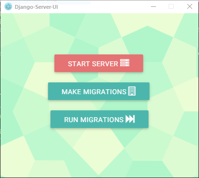

<div align="center">
  
</div>
# Django Server UI

This is a minimal application based on  [Electron](http://electron.atom.io/). It aims to provide a User Interface to most common of actions in Django appliaction development such as running the server. 


## To Use

To clone and run this repository you'll need [Git](https://git-scm.com) , [Node.js](https://nodejs.org/en/download/) (which comes with [npm](http://npmjs.com)) installed on your computer and ofcourse [Django](https://www.djangoproject.com/) from your command line:

```bash
# Clone this repository
git clone https://github.com/frankmaina/Django-Server-UI
# Go into the repository
cd Django-Server-UI
# Install dependencies and run the app
npm install && npm start
```
## Note: Application must be launched within a Django appliaction. 

#### License [(MIT)](https://opensource.org/licenses/MIT)
